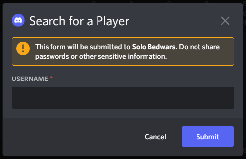

# Solo Bedwars Leaderboard Discord Bot
## **Video Demo**:  *[Leaderboard Discord Bot Showcase](https://www.youtube.com/watch?v=QZmbx4pZrmM)*
Hi! So this is my cs50p final project. I've spent a lot of time in the last few years playing solo bedwars on minecraft, and something I always thought would've been nice when I was trying to get onto the leaderboard was some kind of list to show how much each player on the leaderboard was playing, so that's what I decided to do for this project!

## **Showcase**:

## **Project Files**:

The files that this project uses for scraping, sending requests & storing the data are ``manage_database.py`` and ``wins_database.db``. ``manage_database.py`` inserts a row for each player on the [solo bedwars leaderboard](https://hypixel.net/bedwars/leaderboard/solo), containing the player's username, uuid, leaderboard position, wins, and date for every player in the top 100 players into a SQLite database. It does this every day at 7:30 am Mountain Time, which is when the leaderboards reset in game.

I chose to asychronously run API requests to get player wins because I found that, occasionally, the website's win counts were 1-2 wins behind the API's.

**``wins_database.db``**:

The next file in this project is ``project.py``, which contains the discord bot client as well as functions to create the table of data. As shown above, the discord bot has added buttons for scrolling through the data and a search button which brings up a search field to type a player's username to search for, in the top 100 players.

**Search field showcase**:

In addition, ``project.py`` is responsible for removing players from the table who aren't on the leaderboard anymore. Another thing that is worth mentioning is how if there are days that the bot doesn't have data about, it replaces those in the table with a ``-``. The table is created using the ``tabulate`` library.

**Side note**: both ``project.py`` and ``manage_database.py`` pull api keys/tokens from ``creds.py``

## **Tests**

The final piece of my project was testing my main project's root functions, three of them. I tested all of them using ``unittest`` because I was able to find more information online about how to use mock & patch with unittest, but my tests are able to be run using ``pytest``.

**Testing with ``pytest``**:

I tested the functions I used in ``project.py`` which give the days that should be displayed in the table (``project.get_days()``), get the data and format it as a dictionary of players who are still on the leaderboard, (``project.get_data()``), and I tested the function which returns the most recent date from the data, (``project.get_latest_date()``) which is used in ``project.get_data()`` to find which player's aren't in the set of the most recent leaderboard players.

Another thing that should be noted is the ``data_for_tests`` folder which contains example data in the form of a sqlite database and a dictionary to simulate what should be returned by ``project.get_data()``.

## **Design decisions**:

My initial plan for this project was to end up formatting the amount of wins players got using graphs, but I soon realized how quickly that could become cluttered with so many players, and I thought that formatting my data as a table would be much more effective.

Additionally, I was intiially unsure about how I wanted to give out this data, but I chose to use a discord bot because it's one of the platforms that I use the most, and that a lot of other bedwars players use, and use other discord bots related to bedwars in too.

## **Final thoughts**:

To wrap up, I'm really proud of how this project turned out. I was initially overwhelmed with the lack of structure that this project had, as I was unsure what I wanted to do. However, with the advice of some other students who've taken this class, I decided to try to learn something new and make a project out of that, and I was interested in learning how to do web-scraping.

If I were to do this project again, I would've changed how the data is formatted in discord, because using text through ``tabulate`` is quite limiting for making any improvements in the future, just due to some of the limits with discord character limits, and tabulate styling. As I move forward, I might look into how to format this nicely in an image, which could also make it more readable.